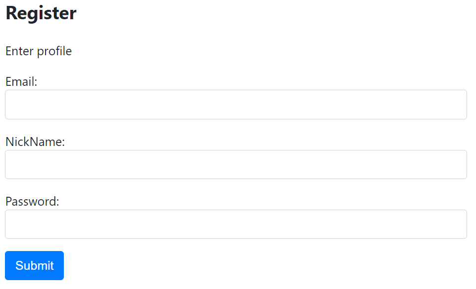

# nodejs_basic_login

simple login

---

### basic_login

- Node.js
- Express
- mySql
- without sequelize

### basic_login2

- mvc pattern

---

| Field    | Type         | Null | Key | Default           | Extra             |
| -------- | ------------ | ---- | --- | ----------------- | ----------------- |
| id       | int          | NO   | PRI | NULL              | auto_increment    |
| email    | varchar(100) | YES  | UNI | NULL              |                   |
| nick     | varchar(5)   | NO   |     | NULL              |                   |
| password | varchar(100) | YES  |     | NULL              |                   |
| createAt | datetime     | YES  |     | CURRENT_TIMESTAMP | DEFAULT_GENERATED |
